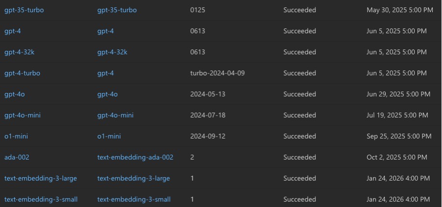

# Quick Start: PHI-safe LLM API Interaction with Python

This guide demonstrates how to use Python to interact with various Large Language Model (LLM) APIs within the Stanford Healthcare environment. These APIs are configured to support HIPAA-compliant use of Protected Health Information (PHI).

*Created by François Grolleau on 02/19/2025 
Contributors: Yixing Jiang 
Last update June 16, 2025.*

## Table of Contents
- [Prerequisites](#prerequisites)
- [Usage](#usage)
- [Common Code for All API Calls](#common-code-for-all-api-calls)
- [OpenAI Models](#openai-models)
  - [GPT-5](#gpt-5-api-call)
  - [GPT-5-mini](#gpt-5-mini-api-call)
  - [GPT-5-nano](#gpt-5-nano-api-call)
  - [GPT-4.1](#gpt-41-api-call)
  - [GPT-4.1-mini](#gpt-41-mini-api-call)
  - [GPT-4.1-nano](#gpt-41-nano-api-call)
- [Anthropic Models](#anthropic-models)
  - [Claude 3.7 Sonnet](#claude-37-sonnet-api-call)
  - [Claude 3.5 Sonnet v2](#claude-35-sonnet-v2-api-call)
- [Google Models](#google-models)
  - [Gemini 2.5 Pro](#gemini-25-pro-api-call)
  - [Gemini 2.0 Flash](#gemini-20-flash-api-call)
- [Meta Models](#meta-models)
  - [Llama 3.3 70B](#llama-33-70b-instruct-api-call)
  - [Llama 4 Maverick](#llama-4-maverick-api-call)
  - [Llama 4 Scout](#llama-4-scout-api-call)
- [Other Models](#other-models)
  - [Microsoft Phi 3.5-mini](#microsoft-phi-35-mini-instruct-api-call)
  - [Deepseek-R1](#deepseek-r1-api-call)
- [PHI & HIPAA Considerations](#important-phi--hipaa-considerations)
- [Bonus: Text-to-Text Generation Helper & Bypass Call Limits](#bonus-1-directly-generate-text-output-from-text-input-bypass-call-limits)
- [Bonus: Easily Swap Between Models](#bonus-2-easily-swap-between-models)


## Prerequisites

- Python 3.6+ with `requests` library installed (`pip install requests`)
- Stanford VPN running on Full traffic, non-split-tunnel (setup [here](https://uit.stanford.edu/service/vpn)).
- API Subscription Key provided by Stanford Healthcare. **Keep this key safe, confidential, and do not share it with anyone.**

## Usage

1. **Set API Key:** In the Python code, replace `# enter your key here` with your Stanford Healthcare API key.
2. **Choose Model & Run:** Select and execute the Python code block corresponding to the LLM you wish to use (e.g., "GPT-4.1 API Call").
3. **Process Response:** The LLM's response is printed as a **JSON string** in `response.text`. Depending on your use case, adapt your code to extract the information you need by parsing this JSON output.
4. **(OPTIONAL)** Use the helper function in the [bonus section](#bonus-1-directly-generate-text-output-from-text-input-bypass-call-limits) to get direct text output, bypass call limits, or easily swap between models.

## Common code for all API calls

```python
import requests
import json

my_key = # enter your key here  <- REPLACE THIS!
my_question = """First, state what LLM you are based on. Next, answer the following hard physics question.
What is the difference between the cosmological constant and the vacuum energy?"""

# Common Headers (Used for all models)
headers = {'Ocp-Apim-Subscription-Key': my_key, 'Content-Type': 'application/json'}
```

---

## OpenAI Models

### GPT-5 API Call
```python
url = "https://apim.stanfordhealthcare.org/openai-eastus2/deployments/gpt-5/chat/completions?api-version=2024-12-01-preview" 
payload = json.dumps({
    "model": "gpt-5", 
    "messages": [{"role": "user", "content": my_question}]
})
response = requests.request("POST", url, headers=headers, data=payload)
print(response.text)
```

### GPT-5-mini API Call
```python
url = "https://apim.stanfordhealthcare.org/openai-eastus2/deployments/gpt-5-mini/chat/completions?api-version=2024-12-01-preview" 
payload = json.dumps({
    "model": "gpt-5-mini", 
    "messages": [{"role": "user", "content": my_question}]
})
response = requests.request("POST", url, headers=headers, data=payload)
print(response.text)
```

### GPT-5-nano API Call
```python
url = "https://apim.stanfordhealthcare.org/openai-eastus2/deployments/gpt-5-nano/chat/completions?api-version=2024-12-01-preview" 
payload = json.dumps({
    "model": "gpt-5-nano", 
    "messages": [{"role": "user", "content": my_question}]
})
response = requests.request("POST", url, headers=headers, data=payload)
print(response.text)
```

### GPT-4.1 API Call
```python
url = "https://apim.stanfordhealthcare.org/openai-eastus2/deployments/gpt-4.1/chat/completions?api-version=2025-01-01-preview" 
payload = json.dumps({
    "model": "gpt-4.1", 
    "messages": [{"role": "user", "content": my_question}]
})
response = requests.request("POST", url, headers=headers, data=payload)
print(response.text)
```

### GPT-4.1-mini API Call
```python
url = "https://apim.stanfordhealthcare.org/openai-eastus2/deployments/gpt-4.1-mini/chat/completions?api-version=2025-01-01-preview" 
payload = json.dumps({
    "model": "gpt-4.1-mini", 
    "messages": [{"role": "user", "content": my_question}]
})
response = requests.request("POST", url, headers=headers, data=payload)
print(response.text)
```

### GPT-4.1-nano API Call
```python
url = "https://apim.stanfordhealthcare.org/openai-eastus2/deployments/gpt-4.1-nano/chat/completions?api-version=2025-01-01-preview" 
payload = json.dumps({
    "model": "gpt-4.1-nano", 
    "messages": [{"role": "user", "content": my_question}]
})
response = requests.request("POST", url, headers=headers, data=payload)
print(response.text)
```

**Other Available OpenAI Models:**  
For other OpenAI models like o1-mini, modify both the URL and payload:

```python
url = "https://apim.stanfordhealthcare.org/openai20/deployments/o1-mini/chat/completions?api-version=2023-05-15" 
payload = json.dumps({
    "model": "o1-mini", 
    "messages": [{"role": "user", "content": my_question}]
})
```




*See the "Model Name" column in these images for valid model names.*

---

## Anthropic Models

### Claude 3.7 Sonnet API Call
```python
url = "https://apim.stanfordhealthcare.org/awssig4claude37/aswsig4claude37"
payload = json.dumps({
    "model_id": "arn:aws:bedrock:us-west-2:679683451337:inference-profile/us.anthropic.claude-3-7-sonnet-20250219-v1:0", 
    "prompt_text": my_question
})
response = requests.request("POST", url, headers=headers, data=payload) 
print(response.text)
```

### Claude 3.5 Sonnet v2 API Call
```python
url = "https://apim.stanfordhealthcare.org/Claude35Sonnetv2/awssig4fa"
payload = json.dumps({
    "model_id": "anthropic.claude-3-5-sonnet-20241022-v2:0", 
    "prompt_text": my_question
})
response = requests.request("POST", url, headers=headers, data=payload) 
print(response.text)
```

---

## Google Models
### Gemini 2.5 Pro API Call
```python
url = "https://apim.stanfordhealthcare.org/gemini-25-pro/gemini-25-pro"
payload = json.dumps({
    "contents": [{"role": "user", "parts": [{"text": my_question}]}]
})
response = requests.request("POST", url, headers=headers, data=payload) 
print(response.text)
```

### Gemini 2.0 Flash API Call
```python
url = "https://apim.stanfordhealthcare.org/gcp-gem20flash-fa/apim-gcp-gem20flash-fa" 
payload = json.dumps({
    "contents": {"role": "user", "parts": {"text": my_question}}, 
    "safety_settings": {"category": "HARM_CATEGORY_SEXUALLY_EXPLICIT", "threshold": "BLOCK_NONE"}, 
    "generation_config": {"temperature": 0.2, "topP": 0.8, "topK": 40}
})
response = requests.request("POST", url, headers=headers, data=payload) 
print(response.text)
```

---

## Meta Models

### Llama 3.3 70B Instruct API Call
```python
url = "https://apim.stanfordhealthcare.org/llama3370b/v1/chat/completions" 
payload = json.dumps({
    "model": "Llama-3.3-70B-Instruct", 
    "messages": [{"role": "user", "content": my_question}]
})
response = requests.request("POST", url, headers=headers, data=payload) 
print(response.text)
```

### Llama 4 Maverick API Call
```python
url = "https://apim.stanfordhealthcare.org/llama4-maverick/v1/chat/completions"
payload = json.dumps({
    "model": "Llama-4-Maverick-17B-128E-Instruct-FP8", 
    "messages": [{"role": "user", "content": my_question}]
})
response = requests.request("POST", url, headers=headers, data=payload) 
print(response.text)
```

### Llama 4 Scout API Call
```python
url = "https://apim.stanfordhealthcare.org/llama4-scout/v1/chat/completions"
payload = json.dumps({
    "model": "Llama-4-Scout-17B-16E-Instruct", 
    "messages": [{"role": "user", "content": my_question}]
})
response = requests.request("POST", url, headers=headers, data=payload) 
print(response.text)
```

---

## Other Models

### Microsoft Phi 3.5-mini Instruct API Call

```python
url = "https://apim.stanfordhealthcare.org/phi35mi/v1/chat/completions"
payload = json.dumps({
    "messages": [{"role": "user", "content": my_question}], 
    "max_tokens": 2048, 
    "temperature": 0.8, 
    "top_p": 0.1, 
    "presence_penalty": 0, 
    "frequency_penalty": 0, 
    "model": "Phi-3.5-mini-instruct"
})
response = requests.request("POST", url, headers=headers, data=payload) 
print(response.text)
```

### Deepseek-R1 API Call
Deepseek models offer strong performance for research and specialized tasks.

```python
url = "https://apim.stanfordhealthcare.org/deepseekr1/v1/chat/completions"
payload = json.dumps({
    "model": "deepseek-chat", 
    "messages": [{"role": "user", "content": my_question}], 
    "temperature": 0.8, 
    "max_tokens": 4096, 
    "top_p": 1, 
    "stream": False
})
response = requests.request("POST", url, headers=headers, data=payload) 
print(response.text)
```

---

## Important PHI & HIPAA Considerations

**WARNING: YOU are responsible for HIPAA compliance when using these APIs with PHI.**
- **Compliance is Your Responsibility:** These APIs are configured for HIPAA, but your usage *must* also be compliant. 
- **Minimize PHI:** Use only the minimum necessary PHI. De-identify data when possible.
- **Follow SHC Policies:** Adhere to all Stanford Healthcare PHI and data security policies (*see* information in [Wiki here](https://github.com/HealthRex/CDSS/wiki/Data-Usage-Training-and-Agreements)).

---

## (BONUS #1) Directly generate text output from text input, bypass call limits

Here's an example to directly generate text output from text input with OpenAI models using the `gen_txt_to_txt` function.

To bypass call limits you can adjust the `max_calls` and `sleep_time` parameters.

```python
import time
def model_init(model_name, my_key):
    headers = {'Ocp-Apim-Subscription-Key': my_key, 'Content-Type': 'application/json'}
    url =  f"https://apim.stanfordhealthcare.org/openai-eastus2/deployments/{model_name}/chat/completions?api-version=2024-12-01-preview"
    return {"model_name": model_name, "url": url, "headers": headers}

def model_call(input_txt, **kwargs):
    model_name = kwargs["model_name"]
    url = kwargs["url"]
    headers = kwargs["headers"]
    payload = json.dumps({"model": model_name, "messages": [{"role": "user", "content": input_txt}]})
    max_calls = 10; sleep_time = 5
    for i in range (max_calls):
        try:
            response = type('Response', (), {'text': "no response from requests.request"})()
            response = requests.request("POST", url, headers=headers, data=payload)
            full_response = json.loads(response.text)['choices'][0]['message']['content']
            break
        except Exception as e:
            print(f"Failed with {model_name} call {i}/{max_calls}, waited {i*sleep_time} seconds. Error: {e}, Response: {response.text}")
            time.sleep(sleep_time)
            full_response = f"Failed to get a response from {model_name} after {i*sleep_time} seconds."
    return full_response

def gen_txt_to_txt(input_txt):
    return model_call(input_txt, **model_init("gpt-5-nano", my_key))

# Usage example:
# response_text = gen_txt_to_txt(my_question)
# print(response_text)
```

## (BONUS #2) Easily Swap Between Models

Use the `API_text_to_text` class from `agnostic_evaluator_models.py` to seamlessly switch between different LLM providers:

```python
from agnostic_evaluator_models import API_text_to_text, meta_init, meta_call, gemini_init, gemini_call, gemini_shc_init, gemini_shc_call
from functools import partial

lab_key = "enter the lab's key here!"

my_question = """What is the difference between the cosmological constant and the vacuum energy?"""

# Using Meta via SHC
llama_init = partial(meta_init, "llama4-maverick", lab_key)
llama_instance = API_text_to_text(llama_init, meta_call)
res = llama_instance.gen_txt_to_txt(my_question)
print(res)

# Using Gemini 2.5 Pro via SHC
gemini_shc_init_partial = partial(gemini_shc_init, "gemini-2.5-pro-preview-05-06", lab_key)
gemini_shc_instance = API_text_to_text(gemini_shc_init_partial, gemini_shc_call)
res = gemini_shc_instance.gen_txt_to_txt(my_question)
print(res)

# Using Gemini 2.5 Pro Preview via Vertex AI
credentials_path = "path/to/your/google_application_default_credentials.json"

gemini25 = partial(gemini_init, "gemini-2.5-pro-preview-03-25", credentials_path)        
gemini_instance = API_text_to_text(gemini25, gemini_call)
res = gemini_instance.gen_txt_to_txt(my_question)
print(res)
```
More examples are provided in the `agnostic_evaluator_models.py` under `if __name__ == "__main__"`

> **Important:** Using Gemini through Vertex AI incurs charges to our GCP project. Please use responsibly - API calls are typically more cost-effective than running self-hosted models on GCP virtual machines, but costs can still accumulate with heavy usage.

> **Note:** If you haven't already set up Google Cloud authentication, you'll need to create an `application_default_credentials.json` file. You can follow the step-by-step instructions in our [Google Cloud setup guide](https://github.com/HealthRex/CDSS/blob/master/scripts/DevWorkshop/ReadMe.GoogleCloud-BigQuery-VPC.txt) to generate and configure these credentials.

*Final fun note: As of June 2025, no model seems to get the physics question right. According to cosmologist Sean Carroll "The vacuum energy and the cosmological constant are two different labels for exactly the same thing; don't let anyone tell you differently" (Quanta and Fields, Dutton, 2024. Chapter 6 p. 146). Looks like latest models continue bullshitting very confidently when facts are rarely in their training data.* 😄
