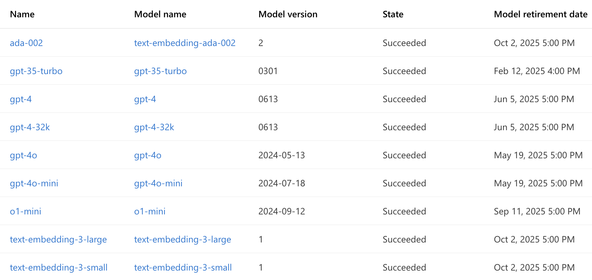

# Quick Start: PHI-safe LLM API Interaction with Python

This guide demonstrates how to use Python to interact with various Large Language Model (LLM) APIs within the Stanford Healthcare environment. These APIs are configured to support HIPAA-compliant use of Protected Health Information (PHI).

*Created by François Grolleau on 02/19/2025, last updated by Yixing on April 22, 2025.*

## Prerequisites

- Python 3.6+ with `requests` library installed (`pip install requests`)
- Stanford VPN running on Full traffic, non-split-tunnel (setup [here](https://uit.stanford.edu/service/vpn)).
- API Subscription Key provided by Stanford Healthcare. **Keep this key safe, confidential, and do not share it with anyone.** **Replace `# enter your key here` with your key in the Python code!**

## Usage

1. **Set API Key:** In the Python code, replace `# enter your key here` with your Stanford Healthcare API key.
2. **Choose Model & Run:** Select and execute the Python code block corresponding to the LLM you wish to use (e.g., "GPT-4o API Call").
3. **Process Response:** The LLM's response is printed as a **JSON string** in `response.text`. Depending on your use case, adapt your code to extract the information you need by parsing this JSON output.

## Common code for all API calls

```python
import requests
import json

my_key = # enter your key here  <- REPLACE THIS!
my_question = """First, state what LLM you are based on. Next, answer the following hard physics question.
What is the difference between the cosmological constant and the vacuum energy?"""

# Common Headers (Used for all models)
headers = {'Ocp-Apim-Subscription-Key': my_key, 'Content-Type': 'application/json'}
```

## GPT-4o API Call
```python
url =  "https://apim.stanfordhealthcare.org/openai20/deployments/gpt-4o/chat/completions?api-version=2023-05-15" 
payload = json.dumps({"model": "gpt-4o", "messages": [{"role": "user", "content": my_question}]})
response = requests.request("POST", url, headers=headers, data=payload)
print(response.text)
```
To use a different OpenAI model, you must modify both the url and the payload. Refer to the 'Model Name' column in the image below for available options. For example, to use the o1-mini model, you would change both the url and payload as shown below:
```python
url =  "https://apim.stanfordhealthcare.org/openai20/deployments/o1-mini/chat/completions?api-version=2023-05-15" 
payload = json.dumps({"model": "o1-mini", "messages": [{"role": "user", "content": my_question}]})
```


*See the "Model Name" column in this image for valid model names.*

## Claude 3.5 Sonnet v2 API Call
```python
url = "https://apim.stanfordhealthcare.org/Claude35Sonnetv2/awssig4fa"
payload = json.dumps({"model_id": "anthropic.claude-3-5-sonnet-20241022-v2:0", "prompt_text": my_question})
response = requests.request("POST", url, headers=headers, data=payload) 
print(response.text)
```

## Claude 3.7 Sonnet API Call
```python
url = "https://apim.stanfordhealthcare.org/awssig4claude37/aswsig4claude37"
payload = json.dumps({"model_id": "arn:aws:bedrock:us-west-2:679683451337:inference-profile/us.anthropic.claude-3-7-sonnet-20250219-v1:0", "prompt_text": my_question})
response = requests.request("POST", url, headers=headers, data=payload) 
print(response.text)
```

## Gemini 2.0 Flash API Call
Model information: https://ai.google.dev/gemini-api/docs/models#gemini-2.0-flash

```python
url = "https://apim.stanfordhealthcare.org/gcp-gem20flash-fa/apim-gcp-oauth-fa"
payload = json.dumps({"contents": {"role": "user", "parts": {"text": my_question}}, "safety_settings": {"category": "HARM_CATEGORY_SEXUALLY_EXPLICIT", "threshold": "BLOCK_NONE"}, "generation_config": {"temperature": 0.2, "topP": 0.8, "topK": 40}})
response = requests.request("POST", url, headers=headers, data=payload) 
print(response.text)
```

## Gemini 1.5 Pro API Call
```python
url = "https://apim.stanfordhealthcare.org/gcpgemini/apim-gcp-oauth-fa" 
payload = json.dumps({"contents": {"role": "user", "parts": {"text": my_question}}, "safety_settings": {"category": "HARM_CATEGORY_SEXUALLY_EXPLICIT", "threshold": "BLOCK_LOW_AND_ABOVE"}, "generation_config": {"temperature": 0.2, "topP": 0.8, "topK": 40}})
response = requests.request("POST", url, headers=headers, data=payload) 
print(response.text)
```

## Llama 3.3 70B Instruct API Call
```python
url = "https://apim.stanfordhealthcare.org/llama3370b/v1/chat/completions" 
payload = json.dumps({"model": "Llama-3.3-70B-Instruct", "messages": [{"role": "user", "content": my_question}]})
response = requests.request("POST", url, headers=headers, data=payload) 
print(response.text)
```

## Microsoft Phi 3.5-mini Instruct API Call
```python
url = "https://apim.stanfordhealthcare.org/phi35mi/v1/chat/completions"
payload = json.dumps({"messages": [{"role": "user", "content": my_question}], "max_tokens": 2048, "temperature": 0.8, "top_p": 0.1, "presence_penalty": 0, "frequency_penalty": 0, "model": "Phi-3.5-mini-instruct"})
response = requests.request("POST", url, headers=headers, data=payload) 
print(response.text)
```

## Deepseek-R1 API Call
```python
url = "https://apim.stanfordhealthcare.org/deepseekr1/v1/chat/completions"
payload = json.dumps({"model": "deepseek-chat", "messages": [{"role": "user", "content": my_question}], "temperature": 0.8, "max_tokens": 4096, "top_p": 1, "stream": False})
response = requests.request("POST", url, headers=headers, data=payload) 
print(response.text)
```

## Important PHI & HIPAA Considerations

**WARNING: YOU are responsible for HIPAA compliance when using these APIs with PHI.**
- Compliance is Your Responsibility: These APIs are configured for HIPAA, but your usage *must* also be compliant. 
- Minimize PHI: Use only the minimum necessary PHI. De-identify data when possible.
- Follow SHC Policies: Adhere to all Stanford Healthcare PHI and data security policies (*see* information in [Wiki here](https://github.com/HealthRex/CDSS/wiki/Data-Usage-Training-and-Agreements)).
