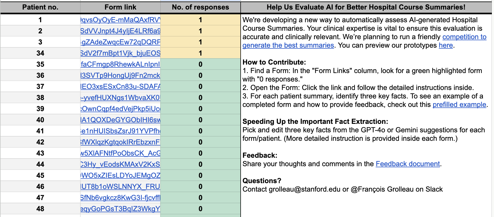

# PHI Annotation for Clinicians: Options Guide

## Overview

Clinician annotation of high-risk PHI data (e.g., free-text clinical notes) inside a convenient web app (e.g., a Flask app) is a common need across many projects. However, GCP will not let you host a VM (see [VM setup guide](https://github.com/HealthRex/CDSS/blob/master/scripts/DevWorkshop/open-weight-llms.md)) that serves this app to users due to patient privacy and cybersecurity constraints.

This guide outlines the available options for setting up PHI annotation workflows.

## Option 1: Simple Approach (Google Sheets + Forms)

- **When to use:** Small-scale projects where a standard spreadsheet workflow is sufficient.
- **How it works:** Have clinicians annotate in a secure Google Spreadsheet, using Google Forms as the frontend.
- **PHI compliance:** Follow the [Cardinal Key setup guide](https://uit.stanford.edu/service/cardinalkey/googledrive) to make Google Drive PHI-compliant.
- **Customization:** You can customize the UI/UX by editing the Google Spreadsheets and Google Forms according to your needs.
- **Recommendation:** This is what we usually recommend. Clinicians are very familiar with this workflow.

Here is an example of what this looked like for a previous project:

## Option 2: Custom Web App

Use this approach when you need a carefully designed web UI for a specific annotation task, and both the displayed PHI and the annotations must live in secure databases. The main bottleneck is security, not building the Flask app or connecting it to a database.

### 2A: Databricks-Based Flask App

- **Requirements:**
  - Access to a PHI-compliant Databricks environment
  - Every annotator needs a Databricks account
  - Annotators must log in with their credentials before accessing the app
- **Considerations:**
  - This is the cleanest solution for hosting a custom annotation app
  - TDS DS folks have implemented this approach
  - Clinicians may find the Databricks login flow adds friction

### 2B: Local App with VPN (Small-Scale Workaround)

- **How it works:**
  - Build a web app and package it as small Mac and PC apps
  - Clicking a file launches the web app locally
  - Annotators download the app on their encrypted laptops (or hospital PCs)
  - Annotators start the Stanford VPN in full-traffic mode with their credentials, then access the app
  - The Flask app uses your personal `application_default_credentials.json` file (stored as a secret) to interact with secure GCP databases

- **User instructions:** Make sure to provide clinicians with clear setup instructions. For example, for a previous project I shared [this user guide](https://drive.google.com/file/d/198wcyr3WBBDO7OqV8ZQOzd8FCLrjqjzg/view?usp=sharing).

- **Pros:**
  - Minimal setup for users (though still not trivial for non-tech-savvy annotators due to VPN and Duo authentication)

- **Cons:**
  - You personally take responsibility since users are effectively accessing databases using your credentials
  - You should create a new `application_default_credentials.json` once the annotation effort is over
  - Does not scale reasonably beyond ~10 annotators
  - Only suitable for annotators you fully trust

## Finding a Scalable Solution

A more sustainable solution for PHI annotation web apps is still being sought. Please feel free to edit, improve, and contribute to this guide.