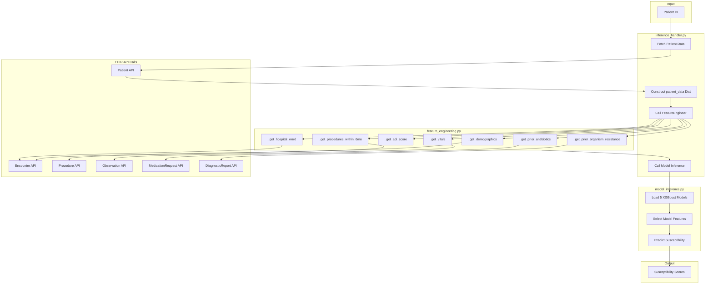

# Antibiotic Susceptibility Inference Pipeline Implementation

## Architecture Overview



---

## Files to Create/Modify

### 1. NEW: [inference_handler.py](HttpTriggerInference/james_model_work/inference_handler.py)

Main orchestration module with:

- `FHIRClient` class - Handles all FHIR API authentication and requests
- `get_susceptibility_scores(patient_id: str)` - Main entry point function
- Fetches patient demographics from `/api/FHIR/R4/Patient/{ID}`
- Constructs `patient_data` dict with FHIR IDs, DOB, gender
- Instantiates `FeatureEngineer` and `AntibioticModelInference`
- Returns dict of antibiotic susceptibility scores

### 2. MODIFY: [feature_engineering.py](HttpTriggerInference/james_model_work/feature_engineering.py)

Refactor existing module to add:| New Method | Purpose | Data Source ||------------|---------|-------------|| `_get_hospital_ward()` | Extract IP/OP/ER ward | Encounter API || `_get_adi_score()` | Return dummy ADI score | Hardcoded 0 || `_get_procedures_within_6mo()` | Extract 6 procedure flags | Procedure API |Changes to existing:

- Comment out `_get_labs()` call in `generate_features()` (not used by models)
- Update `generate_features()` to call new methods
- Add procedure keyword mappings for catheter, CVC, mechvent, etc.

### 3. UPDATE: [__init__.py](HttpTriggerInference/james_model_work/__init__.py)

Export new `inference_handler` functions.---

## Detailed Implementation

### Part 1: inference_handler.py (New File)

```python
# Key structure:
class FHIRClient:
    def __init__(self, api_prefix, client_id, credentials)
    def get_patient(self, patient_fhir_id) -> dict
    def get_encounter(self, patient_fhir_id) -> dict
    def get_procedures(self, patient_fhir_id, days_back=180) -> list

def get_susceptibility_scores(patient_fhir_id: str, credentials: dict = None) -> dict:
    # 1. Initialize FHIR client
    # 2. Fetch patient data (gender, birthDate, identifiers)
    # 3. Construct patient_data dict
    # 4. Initialize FeatureEngineer with patient_data
    # 5. Generate feature vector
    # 6. Initialize AntibioticModelInference
    # 7. Predict and return scores
```


### Part 2: feature_engineering.py Changes

**A. New `_get_hospital_ward()` method:**

- Call Encounter API with `status=in-progress`
- Parse `class.display` field for "OP", "Inpatient", etc.
- Return `{'hosp_ward_IP': 0/1, 'hosp_ward_ER': 0, 'hosp_ward_OP': 0/1}`
- Default ER to 0 (dummy)

**B. New `_get_adi_score()` method:**

- Return `{'adi_score': 0}` (dummy value)

**C. New `_get_procedures_within_6mo()` method:**

- Call Procedure API with `date=ge{6_months_ago}`
- Also call Surgical Procedure API with `category=387713003`
- Parse `code.text` and `code.coding` for keywords:

| Feature | Keywords to Match ||---------|-------------------|| `urethral_catheter_within_6mo` | "catheter", "foley", "urinary" || `cvc_within_6mo` | "central line", "picc", "central venous", "cvc" || `surgical_procedure_within_6mo` | category=387713003 OR "-ectomy", "-otomy", "surgery" || `mechvent_within_6mo` | "ventilat", "intubat", "mechanical vent" || `parenteral_nutrition_within_6mo` | "tpn", "parenteral nutrition" || `nursing_visits_within_6mo` | 0 (dummy) |**D. Update `generate_features()`:**

```python
def generate_features(self, ...):
    self._features = {}
    
    # Demographics (age, gender)
    self._features.update(self._get_demographics())
    
    # Hospital ward (IP/OP/ER)
    self._features.update(self._get_hospital_ward())
    
    # ADI score (dummy)
    self._features.update(self._get_adi_score())
    
    # Procedures within 6 months
    self._features.update(self._get_procedures_within_6mo())
    
    # Vitals
    if include_vitals:
        self._features.update(self._get_vitals(...))
    
    # Labs - COMMENTED OUT (not used by models)
    # if include_labs:
    #     self._features.update(self._get_labs(...))
    
    # Prior antibiotics
    if include_antibiotics:
        self._features.update(self._get_prior_antibiotics(...))
    
    # Prior organism resistance
    if include_prior_resistance:
        self._features.update(self._get_prior_organism_resistance(...))
    
    return pd.DataFrame([self._features])


```