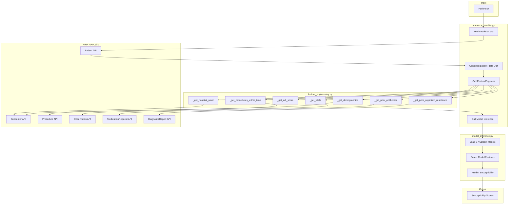

```mermaid
flowchart TB
    subgraph input [Input]
        PatientID[Patient ID]
    end
    
    subgraph handler [inference_handler.py]
        FetchPatient[Fetch Patient Data]
        ConstructDict[Construct patient_data Dict]
        CallFE[Call FeatureEngineer]
        CallModel[Call Model Inference]
    end
    
    subgraph fhir [FHIR API Calls]
        PatientAPI[Patient API]
        EncounterAPI[Encounter API]
        ProcedureAPI[Procedure API]
        VitalsAPI[Observation API]
        MedsAPI[MedicationRequest API]
        CultureAPI[DiagnosticReport API]
    end
    
    subgraph fe [feature_engineering.py]
        Demographics[_get_demographics]
        HospWard[_get_hospital_ward]
        ADI[_get_adi_score]
        Procedures[_get_procedures_within_6mo]
        Vitals[_get_vitals]
        PriorAbx[_get_prior_antibiotics]
        PriorInfect[_get_prior_organism_resistance]
    end
    
    subgraph model [model_inference.py]
        LoadModels[Load 5 XGBoost Models]
        SelectFeatures[Select Model Features]
        Predict[Predict Susceptibility]
    end
    
    subgraph output [Output]
        Scores[Susceptibility Scores]
    end
    
    PatientID --> FetchPatient
    FetchPatient --> PatientAPI
    PatientAPI --> ConstructDict
    ConstructDict --> CallFE
    CallFE --> Demographics & HospWard & ADI & Procedures & Vitals & PriorAbx & PriorInfect
    Demographics --> EncounterAPI
    HospWard --> EncounterAPI
    Procedures --> ProcedureAPI
    Vitals --> VitalsAPI
    PriorAbx --> MedsAPI
    PriorInfect --> CultureAPI
    fe --> CallModel
    CallModel --> LoadModels --> SelectFeatures --> Predict
    Predict --> Scores
```
